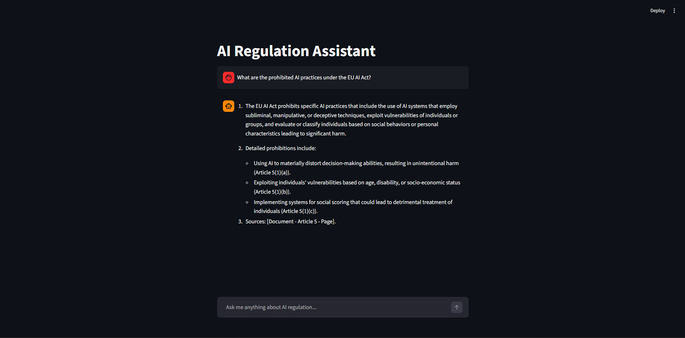

# 🤖 AI Compliance RAG Assistant

A domain-specific chatbot that answers questions about AI regulations 
based exclusively on official documents — no hallucinations, no guesswork.

Anyone in a company — legal, technical, or product — can ask plain-language 
questions and get precise answers with source citations, without reading 
hundreds of pages of legal text.

Currently covers:
- 🇪🇺 EU AI Act (Regulation EU 2024/1689)
- 🇺🇸 NIST AI Risk Management Framework (AI RMF 1.0)

---

## 📸 Demo



---

## 🏗️ Architecture

1. **Ingestion** — PDF extraction → chunking (450 tokens, 80 overlap) 
   → embeddings (text-embedding-3-small) → FAISS index
2. **Query** — question vectorisée → top-4 chunks retrieval 
   → augmented prompt → GPT-4o-mini response with citations

---

## 🛠️ Stack Technique

| Composant | Technologie |
| :--- | :--- |
| **AI** | OpenAI API (`gpt-4o-mini`, `text-embedding-3-small`) |
| **Vector Store** | FAISS (Facebook AI Similarity Search) |
| **Backend** | FastAPI (Python 3.11) |
| **Frontend** | Streamlit |
| **Data Processing** | Tiktoken (tokenization with overlap), PyPDF |

---

## 🚀 Installation & Lancement

### 1. Backend
```bash
cd backend
python -m venv .venv
# Windows :
.venv\Scripts\activate
# Linux/Mac :
source .venv/bin/activate
pip install -r requirements.txt
# Create a .env file with your OPENAI_API_KEY
uvicorn main:app --reload
```

### 2. Ingest documents
Once the backend is running:
```bash
curl -X POST http://localhost:8000/ingest
```
Or use Swagger UI at `http://localhost:8000/docs`

### 3. Frontend
```bash
cd frontend
streamlit run app.py
```

---

## ⚠️ Known Limitations

- **Cross-document questions** — comparative questions across jurisdictions 
  may not retrieve sufficient context
- **Tables and figures** — complex tables in PDFs may not be fully extracted 
  by the current text parser
- **Page citations** — page numbers reference the PDF structure, 
  not the official article numbering

---

## 🗺️ Roadmap

- [ ] Add metadata (source, article, page) to chunks for precise citations
- [ ] China Generative AI Regulation support
- [ ] Brazil AI Bill support
- [ ] Multi-jurisdiction filtering in the UI
- [ ] Replace PyPDF with pdfplumber for better table extraction