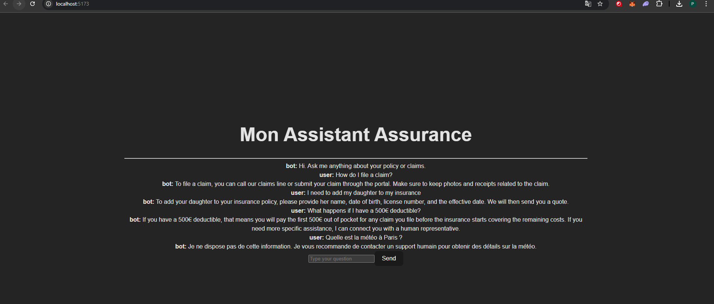
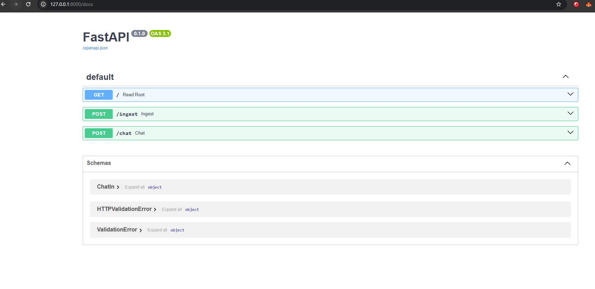

# 🤖 AI Compliance RAG Assistant

A RAG-powered assistant that helps legal, technical, and product teams 
navigate AI regulations without reading hundreds of pages of legal text.

Currently covers:
- 🇪🇺 EU AI Act (Regulation 2024/1689)
- 🇺🇸 NIST AI Risk Management Framework (AI RMF 1.0)

As AI regulation expands globally, companies need to understand their 
compliance obligations fast. This assistant answers specific questions 
and cites the exact article and page — so teams can act, not just read.
---

## 📸 Aperçu du Projet

### Interface Utilisateur (React)
L'interface permet une interaction fluide en langage naturel. Le moteur RAG identifie les concepts clés (ex: "daughter" mappé vers "add a driver") même sans correspondance de mots-clés exacts.



### Documentation API (FastAPI)
Le backend est conçu de manière industrielle avec une documentation interactive (Swagger) facilitant l'intégration et les tests.



---

## 🎯 Points Clés & Objectifs
Ce projet démontre les piliers fondamentaux attendus pour un rôle de **AI Engineer** :

* **Pipeline RAG complet :** Ingestion automatisée de PDF, segmentation intelligente (chunking) et stockage vectoriel.
* **Recherche Sémantique :** Utilisation d'embeddings de pointe pour capturer l'intention réelle de l'utilisateur plutôt que de simples mots-clés.
* **Fiabilité & Sécurité (Guardrails) :** Le bot suit des instructions strictes pour ne répondre qu'à partir du contexte fourni, évitant ainsi les hallucinations et garantissant la conformité métier.
* **Architecture Découplée :** Séparation propre entre le moteur IA (FastAPI) et l'interface utilisateur (React) pour une meilleure scalabilité.

---

## 🛠️ Stack Technique

| Composant | Technologie |
| :--- | :--- |
| **Intelligence Artificielle** | OpenAI API (`gpt-4o-mini`, `text-embedding-3-small`) |
| **Vector Store** | FAISS (Facebook AI Similarity Search) |
| **Backend** | FastAPI (Python 3.11) |
| **Frontend** | React + Vite |
| **Traitement de Données** | Tiktoken (Tokenization avec overlap), PyPDF |

---

## 🏗️ Architecture du Système

1.  **Ingestion (`/ingest`) :** Extraction du texte PDF -> Chunking avec Tiktoken (500 tokens, 50 overlap) -> Vectorisation -> Indexation FAISS.
2.  **Requête (`/chat`) :** Vectorisation de la question -> Recherche des $k=4$ voisins les plus proches -> Augmentation du Prompt avec contexte -> Génération de la réponse via LLM.

---

## 🚀 Installation & Lancement

### 1. Backend
```powershell
cd backend
python -m venv .venv
# Windows :
.venv\Scripts\activate
# Linux/Mac :
source .venv/bin/activate
pip install -r requirements.txt
# Créer un fichier .env avec votre OPENAI_API_KEY
uvicorn main:app --reload
```

### 2. Frontend

```powershell
cd frontend
npm install
npm run dev
```
